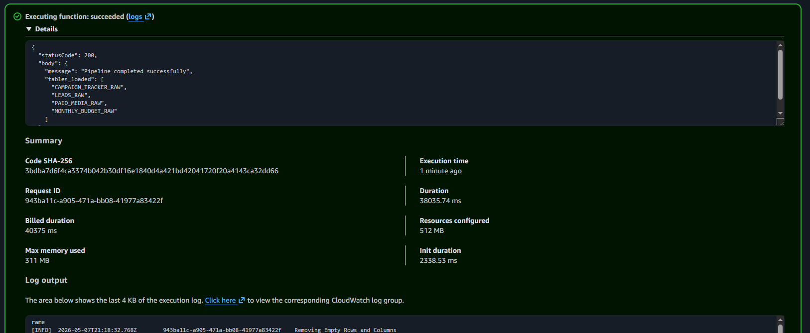

# Proof of Run

This folder contains evidence from a successful run of the Google Sheets to Snowflake pipeline.
The SQL used to produce the Snowflake query outputs is available here:

[`queries.sql`](queries.sql)

## 1. Lambda Execution

The Lambda function completed successfully. The exported CloudWatch log is available here:

[`cloudwatch-log-events.csv`](cloudwatch-log-events.csv)

## 2. RAW Layer Load

The RAW layer row-count query confirms that all four source datasets were loaded into Snowflake.

Output: [`01_raw_layer_row_counts.csv`](query-results/01_raw_layer_row_counts.csv)

## 3. Source Lineage

The pipeline preserves source workbook and worksheet lineage through `DATASOURCE` and `DATASOURCE_SHEET`.

Output: [`02_source_sheet_lineage.csv`](query-results/02_source_sheet_lineage.csv)

## 4. RAW to STG Validation

The RAW-to-STG comparison shows how many records were available before and after staging transformations.

Output: [`03_raw_to_stg_row_count_comparison.csv`](query-results/03_raw_to_stg_row_count_comparison.csv)

Note: `PAID_MEDIA` has one fewer staged row than raw rows because staging excludes or flags invalid source records.

## 5. Staging Transformations

The staging outputs demonstrate normalized campaign, platform, date, budget, and metric fields.

Outputs:

- [`04_stg_paid_media_cleanup_sample.csv`](query-results/04_stg_paid_media_cleanup_sample.csv)
- [`05_stg_leads_aggregate.csv`](query-results/05_stg_leads_aggregate.csv)
- [`06_monthly_budget_unpivot_sample.csv`](query-results/06_monthly_budget_unpivot_sample.csv)

## 6. Data Quality Findings

The pipeline surfaces source-data issues instead of silently hiding them.

Outputs:

- [`07_paid_media_quality_issues.csv`](query-results/07_paid_media_quality_issues.csv)
- [`08_monthly_budget_quality_issues.csv`](query-results/08_monthly_budget_quality_issues.csv)

## 7. Analytics Layer

The analytics outputs show that the pipeline produces queryable reporting objects for funnel analysis and spend-vs-budget reporting.

Outputs:

- [`09_analytics_object_row_counts.csv`](query-results/09_analytics_object_row_counts.csv)
- [`10_client_monthly_funnel_mart.csv`](query-results/10_client_monthly_funnel_mart.csv)
- [`11_spend_vs_budget_mart.csv`](query-results/11_spend_vs_budget_mart.csv)
- [`12_campaign_mapping_sample.csv`](query-results/12_campaign_mapping_sample.csv)

## Takeaway

This run demonstrates an end-to-end batch ingestion workflow from Google Sheets into Snowflake, including schema enforcement, lineage, staging transformations, data-quality checks, and analytics-layer outputs.